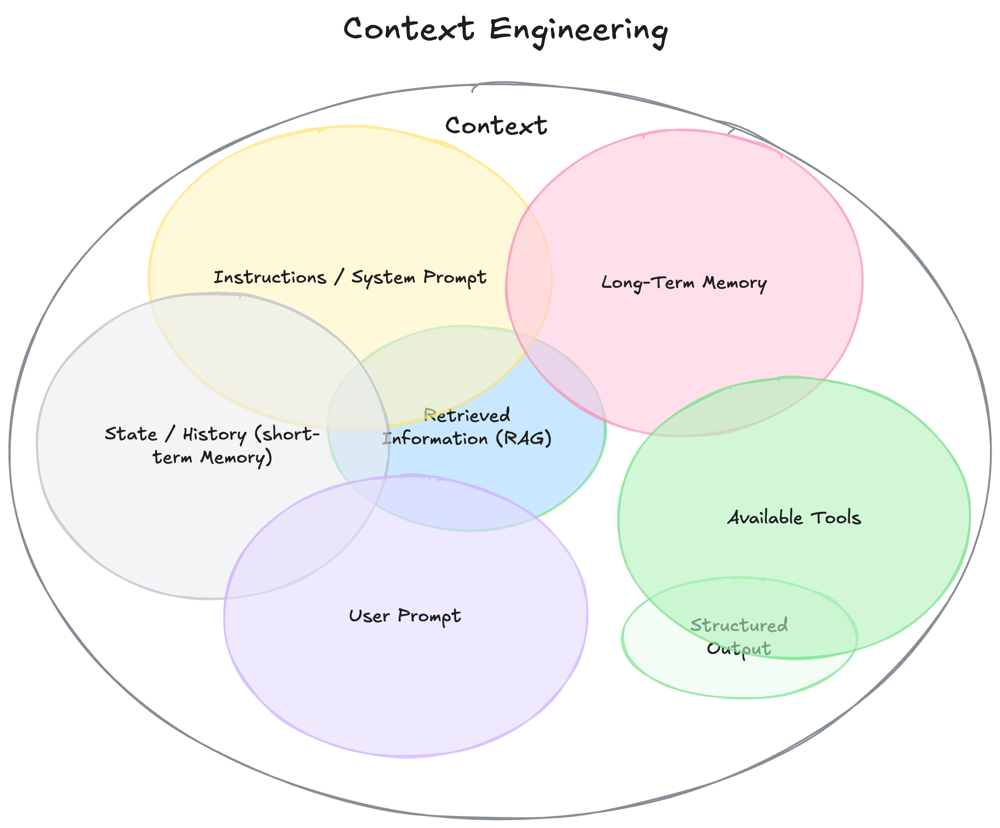

## What is a Context?
- Everything that model sees before generating response

1. **Instructions / System Prompt:** What you tell the model to be and how to behave, set by you the developer, never changes mid-conversation.

2. **Long-Term Memory:** Information persisted across sessions, stored externally and injected back into context when needed.

3. **State / History (Short-Term Memory):** The conversation so far, what the model uses to maintain coherence across turns.

4. **Retrieved Information (RAG):** External knowledge fetched on demand and dropped into context, so the model can answer beyond its training data.

5. **User Prompt:** What the user actually said this turn.

6. **Available Tools:** Functions the model can call (search, calculator, APIs) and their definitions live in context so the model knows what it can use.

7. **Structured Output:** The format constraint you impose on the response, telling the model exactly what shape to return.

## Why to manage context:
since models have limited context window length managing the context we send is essential to avoid unexpected behaviour, underperformance, hallucinations or breakage of pipelines.

### How to manage?
Managing context can be achieved through different strategies like
1. Sliding window: trimming the oldest messages in the conversation chain
2. Retrieval strategy: embedding the context and retrieving only needy information based on turns.
3. Summarisation: summarising the long context, which later replaces the long context
Handling the exception or errors like thrashing while summarising or compressing is non negotiable.

As you can see they are lossy compressions over long contexts hence even well maintained proprietary models hallucinate in the long context and they maintain a system remainder which triggers after a long context session hoping to psychologically stop the user before providing the useless or hallucinated content.

**Note:** Context engineering is broader and prompt engineering lives within.

